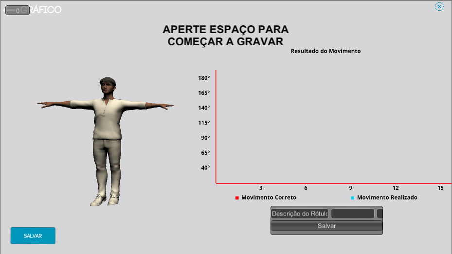

# Reabilitação Motora

## Link para o site do projeto
[Reabilitação motora](https://fga-gpp-mds.github.io/2018.1-Reabilitacao-Motora/)

## Download do launcher da aplicação
- [Arquivo zip](https://github.com/arthurbdiniz/Launcher/raw/master/build/distributions/launcher.zip)
- [Arquivo tar](https://github.com/arthurbdiniz/Launcher/raw/master/build/distributions/launcher.tar)

&emsp;&emsp;Este trabalho propõe o desenvolvimento de uma plataforma de captura, monitoramento e avaliação de movimentos realizados em sessões de fisioterapia. Os dados coletados são fornecidos ao fisioterapeuta ou a qualquer outra aplicação capaz de operar o produto em questão.

 

&emsp;&emsp;O corpo humano é dividido em três partes fundamentais: cabeça, tronco e membros. Sendo os membros classificados em superiores e inferiores. O movimento desses membros é algo essencial para que uma pessoa possa executar tarefas no dia a dia, e ter uma vida apropriada.

&emsp;&emsp;Porém, existem cada vez mais pessoas sendo afetadas por algo popularmente conhecido como derrame cerebral, um problema neurológico decorrente de uma obstrução ou rompimento dos vasos sanguíneos cerebrais. Essas vítimas, ao sofrerem de um AVC (derrame cerebral), podem ficar com algumas sequelas motoras e/ou neurológicas, como paralisia, falta de sensibilidade, dificuldade na fala, depressão e transtorno de estresse pós-traumático. Para amenizar as sequelas motoras, sessões de fisioterapia são realizadas com o objetivo de devolver parte da movimentação causada pela paralisia.

&emsp;&emsp;Sendo assim fisioterapeutas são necessários para auxiliar na recuperação do paciente, realizando um acompanhamento para verificar o ganho de amplitude de movimentos, ajudar com alongamentos e mobilizações passivas em todos os planos de movimentos. Cabe ao fisioterapeuta a tarefa de analisar o progresso de seu paciente visualmente ou utilizando tecnologias que provem métodos de aquisição de dados do paciente, o que não é um trabalho fácil e nem possui uma certa agilidade.

&emsp;&emsp;A falta de eficiência e demora das análises fisiterapêuticas são a principal motivação do projeto. Os fisioterapeutas gastam muito tempo durante uma sessão para analisar os dados coletados durante a mesma, sobrando assim pouco tempo para se focar no paciente. Além disso, por se tratar de um trabalho humano, a análise desses dados é muito subjetiva e qualitativa.

## Aplicação

&emsp;&emsp;Propomos uma aplicação multiplataforma que realiza a captura e a comparação entre movimentos, para que desse modo o fisioterapeuta obtenha dados quantitativos com relação aos movimentos do paciente, e não só dados qualitativos e subjetivos para acompanhar a evolução do mesmo. A ideia da aplicação é de facilitar a sessão gerenciada pelo fisioterapeuta, ou seja, o processo de captura de dados através de movimentos e a análise desses dados gerados.

&emsp;&emsp;A captura de movimento será feita através de um sensor. Como sensor base temos o Kinect, mas a aplicação é capaz de comunicar-se com qualquer sensor que utiliza de uma porta TCP. Enquanto a central de processamento se conectará à aplicação principal com o uso de um adapter. (Para mais informações, acesse: Documento de arquitetura).

&emsp;&emsp;Inicialmente, o fisioterapeuta cadastra um certo movimento que será realizado numa dada sessão. Esse movimento funcionará como um "modelo" que o paciente deverá seguir. Durante a sessão o paciente tentará copiar o movimento do fisioterapeuta, que será mostrado na tela, juntamente com o esqueleto espelhado do paciente, para que o mesmo tenha uma noção do quão próximo ele está do movimento correto.

&emsp;&emsp;Além da comparação e avaliação de movimentos com feedback instantâneo, os exercícios realizados pelo paciente são armazenados para que se possa acompanhar o processo de evolução do paciente. Esse acompanhamento permite que o fisioterapeuta melhore a qualidade das sessões, visto que ele pode mudar o tipo de exercício e/ou indicar outros métodos e dicas para o paciente, de acordo com a evolução do paciente.

## Começando no Projeto

Estas instruções vão te ajudar a ter a última versão do código em sua máquina local.

### Pré-requisitos

É necessário ter o Unity 3D instalado para que possa fazer alterações efetivas no projeto. Lembrando que a versão no qual o projeto foi constrído é a 2017.3.

Para fazer download do Unity clique [aqui](https://store.unity.com/).

### Instalando

Por causa da simplicidade do Unity basta clonar o projeto e depois abrí-lo com ele, se tiver na versão certa do Unity não haverá nenhuma alteração de arquivos apenas com a abertura.

## Licença

MIT License  
Copyright (c) 2018 EPS/MDS

[Licença](https://github.com/fga-gpp-mds/2018.1-Reabilitacao-Motora/blob/master/LICENSE)
