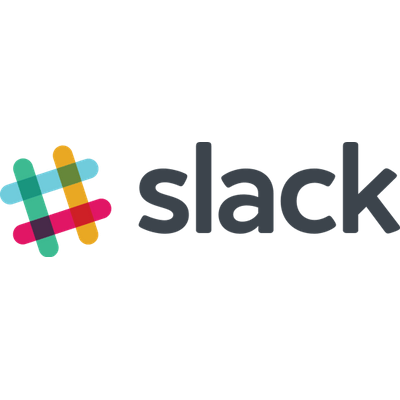
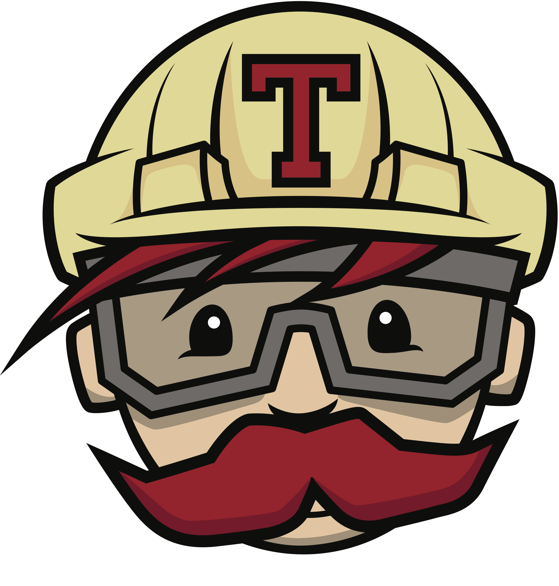

     
    

# [Reabilitação motora](https://fga-gpp-mds.github.io/2018.1-Reabilitacao-Motora/)

&emsp;&emsp; Projeto da disciplina de EPS/MDS da <a href"https://www.unb.br/"> Universidade de Brasília</a>. Tem como objetivo apresentar um produto capaz de realizar um auxílio maior juntamente com os profissionais fisioterapeutas. O produto é responsável por medir e armazenar os resultados dos pacientes que sofreram perda motora em membros superiores, auxiliando os fisioterapeutas no acompanhamento dos resultados obtidos nas sessões de fisioterapia. 

&emsp;&emsp; Este projeto propõe o desenvolvimento de uma plataforma de captura, monitoramento e avaliação de movimentos realizados em sessões de fisioterapia. Os dados coletados são fornecidos ao fisioterapeuta ou a qualquer outra aplicação capaz de operar os dados em questão.

## Pretexto

&emsp;&emsp; O corpo humano é dividido em três partes fundamentais: cabeça, tronco e membros. Sendo os membros classificados em superiores e inferiores. O movimento desses membros é algo essencial para que uma pessoa possa executar tarefas no dia a dia, e ter uma vida apropriada.

&emsp;&emsp; Porém, existem cada vez mais pessoas sendo afetadas por diversas doenças que podem ocasionar na perda motora, parcial ou total, dos membros superiores. Essas vítimas, podem ficar com algumas sequelas motoras e/ou neurológicas, como paralisia, falta de sensibilidade. Para amenizar as sequelas motoras, sessões de fisioterapia são realizadas com o objetivo de devolver parte da movimentação causada pela paralisia.

&emsp;&emsp; Sendo assim fisioterapeutas são necessários para auxiliar na recuperação do paciente, realizando um acompanhamento para verificar o ganho de amplitude de movimentos, ajudar com alongamentos e mobilizações passivas em todos os planos de movimentos. Cabe ao fisioterapeuta a tarefa de analisar o progresso de seu paciente visualmente ou utilizando tecnologias que provem métodos de aquisição de dados do paciente, o que não é um trabalho fácil e nem possui uma certa agilidade.

&emsp;&emsp;A falta de eficiência e demora das análises fisioterapêuticas são a principal motivação do projeto. Os fisioterapeutas gastam muito tempo durante uma sessão para analisar os dados coletados durante a mesma, sobrando assim pouco tempo para se focar no paciente. Além disso, por se tratar de um trabalho humano, a análise desses dados é muito subjetiva e qualitativa.

## Produto

&emsp;&emsp; Propomos uma aplicação multiplataforma (<a href"http://ec2-18-231-174-28.sa-east-1.compute.amazonaws.com:3000/file_objects/732/windows.zip">Windows</a>, <a href"/file_objects/733/linux.zip">Linux</a>, <a href"http://ec2-18-231-174-28.sa-east-1.compute.amazonaws.com:3000/file_objects/734/mac.zip">Mac</a>) que realiza a captura e a comparação entre movimentos, para que desse modo o fisioterapeuta obtenha dados quantitativos com relação aos movimentos do paciente, e não só dados qualitativos e subjetivos para acompanhar a evolução do mesmo. A ideia da aplicação é de facilitar a sessão gerenciada pelo fisioterapeuta, ou seja, o processo de captura de dados através de movimentos e a análise desses dados gerados.

&emsp;&emsp;A captura de movimento será feita através de um sensor. Como sensor base temos o Kinect, mas a aplicação é capaz de comunicar-se com qualquer sensor que utiliza de uma porta UDP. Enquanto a central de processamento se conectará à aplicação principal com o uso de um adapter.

&emsp;&emsp; Inicialmente, o fisioterapeuta cadastra um certo movimento que será realizado numa dada sessão. Esse movimento funcionará como um "modelo" que o paciente deverá seguir. Durante a sessão o paciente tentará copiar o movimento do fisioterapeuta, que será mostrado na tela, juntamente com o esqueleto espelhado do paciente, para que o mesmo tenha uma noção do quão próximo ele está do movimento correto.

&emsp;&emsp; Além da comparação e avaliação de movimentos com feedback instantâneo, os exercícios realizados pelo paciente são armazenados para que se possa acompanhar o processo de evolução do paciente. Esse acompanhamento permite que o fisioterapeuta melhore a qualidade das sessões, visto que ele pode mudar o tipo de exercício e/ou indicar outros métodos e dicas para o paciente, de acordo com a evolução do paciente.

## Download do launcher da aplicação
- [Arquivo zip](https://github.com/arthurbdiniz/Launcher/raw/master/build/distributions/launcher.zip)
- [Arquivo tar](https://github.com/arthurbdiniz/Launcher/raw/master/build/distributions/launcher.tar)

## Configuração do UDP Windows

> [Link para o tutorial de configuração](https://github.com/fga-gpp-mds/2018.1-Reabilitacao-Motora/blob/Readme/docs/wiki/tutorial_windows_udp.md)
---

# Desenvolvedores

### Começando no Projeto

Estas instruções vão te ajudar a ter a última versão do código em sua máquina local.

### Pré-requisitos

> É necessário ter o Unity 3D instalado para que possa fazer alterações efetivas no projeto.

> Para fazer download do Unity clique [aqui](https://store.unity.com/).

### Instalando

&emsp;&emsp; Por causa da simplicidade do Unity basta <a href"https://github.com/fga-gpp-mds/2018.1-Reabilitacao-Motora.git"> clonar </a> o projeto e depois abri-lo com ele, se tiver na versão certa do Unity não haverá nenhuma alteração de arquivos apenas com a abertura.

### Contribuindo

&emsp;&emsp; Após realizar o pré-requisitos de instalação e atualização de código, para contribuir no projeto basta seguir os estilos de <i>Issue</i> e <i>Pull Request</i> a abri-los conforme achar necessário as equipes de EPS e MDS irão avaliar o <i>PR</i> e caso esteja tudo dentro dos padrões o Merge será realizado, caso ocorra algum problema no próprio <i>PR</i> será feita a revisão solicitando as correções. Um ponto importante é seguir as políticas do repositório que estão definidas nestes documentos abaixo : 

> - [_Branches_](https://github.com/fga-gpp-mds/2018.1-Reabilitacao-Motora/blob/development/docs/policies/branches.md)
> - [_Commits_](https://github.com/fga-gpp-mds/2018.1-Reabilitacao-Motora/blob/development/docs/policies/commits.md)
> - [_Issues_](https://github.com/fga-gpp-mds/2018.1-Reabilitacao-Motora/blob/development/docs/policies/issue.md)
> - [_Pull Request_](https://github.com/fga-gpp-mds/2018.1-Reabilitacao-Motora/blob/development/docs/policies/pull_request.md)
> - [Folha de Estilo](https://github.com/fga-gpp-mds/2018.1-Reabilitacao-Motora/blob/development/docs/policies/style_sheet.md)

# Esclarecimentos Técnicos.

## Arquitetura
> [Documento de Arquitetura](https://github.com/fga-gpp-mds/2018.1-Reabilitacao-Motora/blob/master/docs/wiki/Documento-de-Arquitetura.md)

## Integração Contínua

> [Integração contínua do _Unity_ com _Travis_]()

## Repositórios Paralelos
> Área Destinada a mostrar os repositórios que contribuem de maneira paralela para o desenvolvimento do Reabilitação Motora.

> - [Spatium (API de Deploy Contínuo)](https://github.com/fga-gpp-mds/2018.1-Reabilitacao-Motora-Spatium-API)
> - [launcher](https://github.com/fga-gpp-mds/2018.1-Reabilitacao-Motora-Launcher)
> - [App Mobile (IMU)](https://github.com/fga-gpp-mds/2018.1-Reabilitacao-Motora-UDP-App-Android)

## Ferramentas Utilizadas

## Licença

MIT License  
Copyright (c) 2018 EPS/MDS

[Licença](https://github.com/fga-gpp-mds/2018.1-Reabilitacao-Motora/blob/master/LICENSE)
