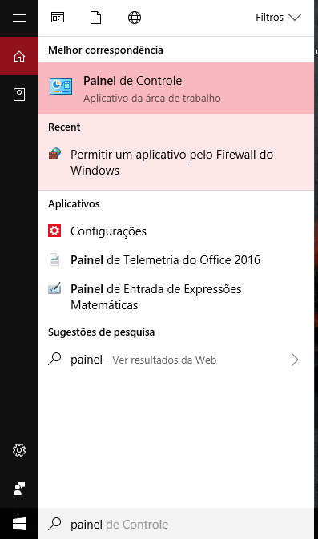
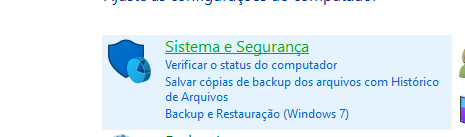
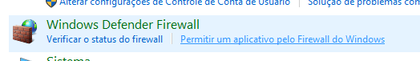
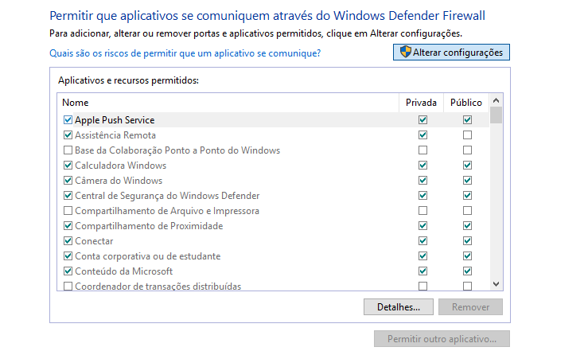
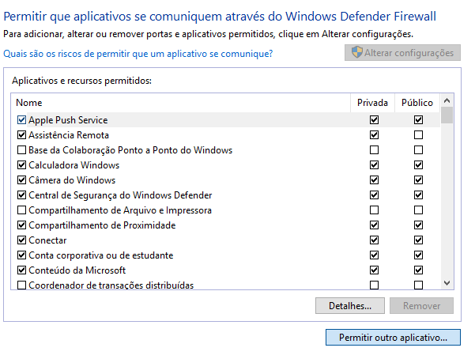
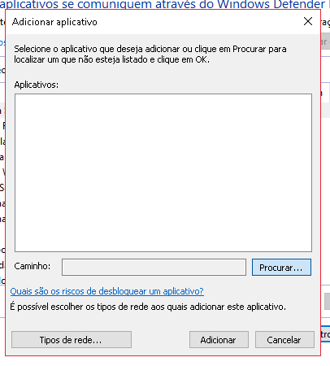
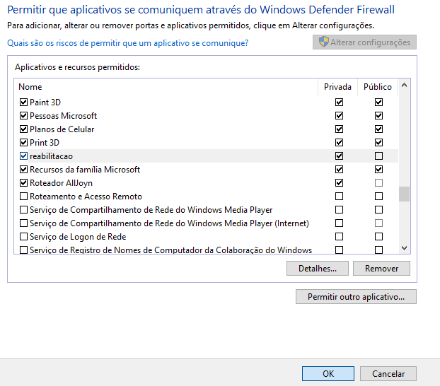

| Data | Versão | Descrição | Autor(es) |
| :---: | :---: | --- | :---: |
| 26/06/2018 | 1.0 | Criação do documento | Romeu Antunes |

# Tutorial para Rodar o sensor UDP no Windows

## 1º Passo
  Abrir o painel de Controle

  

## 2º Passo
  Acesse a opção Sistema e segurança

  

## 3º Passo
  Acesse a opção firewall, permitir um aplicativo pelo Firewall do Windows

  

## 4º Passo
  Altere as configurações de firewall.

  

## 5º Passo
  Permita outro Aplicativo no Firewall

  

## 6º Passo
  Ache o caminho para o aplicativo do Reabilitação Motora

  

## 7º Passo
  Adicione o aplicativo

  

## 8º Passo
  Clicar em OK e rodar a aplicação normalmente
  
